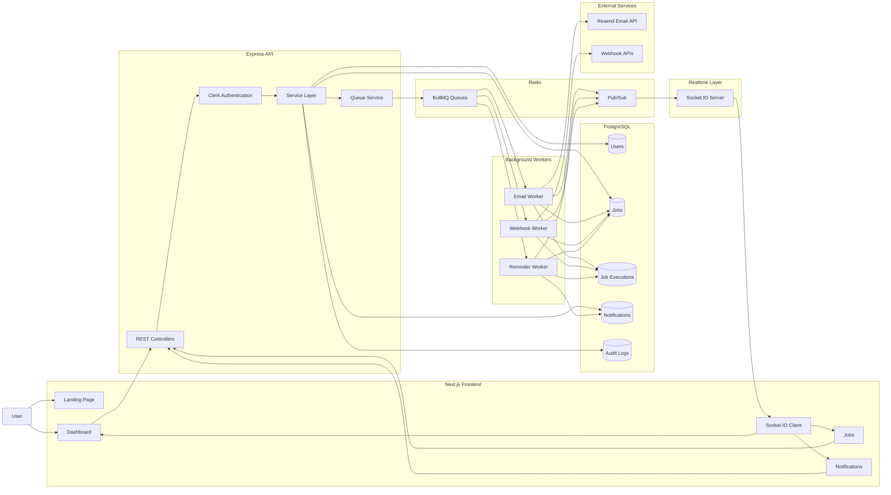
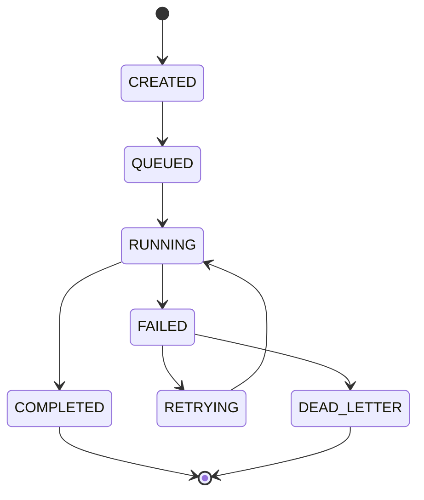
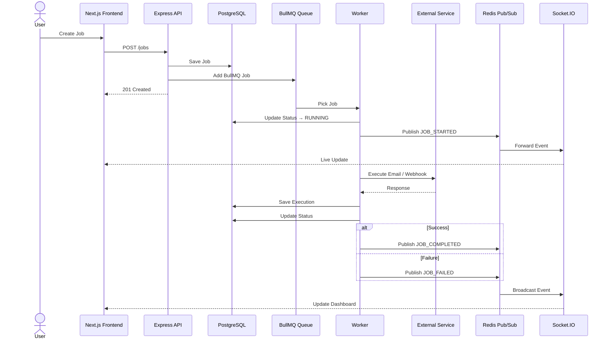

# ⚡ CronosQ — Distributed Job Scheduling Platform

A production-ready distributed job scheduling platform that enables reliable execution of background jobs such as **Email**, **Webhook**, and **Reminder** tasks with support for retries, delayed execution, real-time status updates, execution history, and audit logging.

Built using **Node.js**, **Express**, **TypeScript**, **BullMQ**, **Redis**, **PostgreSQL**, **Prisma**, and **Socket.IO**.

---

## ✨ Features

- 📧 Email Job Scheduling
- 🌐 Webhook Execution
- ⏰ Reminder Jobs
- 🕒 Delayed & Scheduled Jobs
- 🔁 Automatic Retry with Exponential Backoff
- 💀 Dead Letter Handling
- 📜 Job Execution History
- 📊 Job Lifecycle Tracking
- 🔔 Real-time Updates via Socket.IO
- 📡 Redis Pub/Sub Event Streaming
- 🔐 Clerk Authentication
- 📝 Audit Logging
- ✅ Zod Validation
- ⚡ Type-safe Prisma ORM

---

# Tech Stack

## Backend

- Node.js
- Express.js
- TypeScript
- Prisma ORM
- PostgreSQL (Supabase)

## Queue

- BullMQ
- Redis (Upstash)

## Authentication

- Clerk

## Real-time

- Socket.IO
- Redis Pub/Sub

## Validation

- Zod

---

## High Level Architecture



---
# Job Lifecycle



---
# Job Processing Pipeline



---

# Project Structure

```
backend/
│
├── src
│   ├── config
│   ├── controllers
│   ├── routes
│   ├── middlewares
│   ├── services
│   ├── workers
│   ├── processors
│   ├── queues
│   ├── socket
│   ├── events
│   ├── validators
│   ├── utils
│   ├── prisma
│   └── app.ts
│
└── prisma
    └── schema.prisma
```

---

# Supported Job Types

## Email

Sends scheduled emails.

Payload

```json
{
  "to": "user@example.com",
  "subject": "Welcome",
  "body": "Hello World"
}
```

---

## Webhook

Executes HTTP requests.

Payload

```json
{
  "url": "https://example.com/webhook",
  "method": "POST",
  "headers": {},
  "body": {}
}
```

---

## Reminder

Creates reminder notifications and optionally sends emails.

Payload

```json
{
  "title": "Meeting",
  "message": "Join meeting in 10 minutes",
  "channels": [
    "EMAIL",
    "IN_APP"
  ]
}
```

---

# Worker Architecture

Each job type has an independent worker.

```
Email Queue
    ↓
Email Worker

Webhook Queue
    ↓
Webhook Worker

Reminder Queue
    ↓
Reminder Worker
```

This makes the platform horizontally scalable.

---

# Real-time Updates

Workers publish lifecycle events through Redis Pub/Sub.

```
Worker

↓

Redis Pub/Sub

↓

Socket.IO

↓

Frontend
```

Supported events

- JOB_STARTED
- JOB_COMPLETED
- JOB_FAILED
- JOB_RETRY

---

# REST APIs

## Jobs

| Method | Endpoint |
|----------|----------|
| POST | `/jobs` |
| GET | `/jobs` |
| GET | `/jobs/:id` |

---

## Notifications

| Method | Endpoint |
|----------|----------|
| GET | `/notifications` |
| GET | `/notifications/:id` |

---

# Reliability Features

- BullMQ Retry Strategy
- Exponential Backoff
- Delayed Execution
- Dead Letter Handling
- Persistent Execution History
- Idempotent Job IDs
- Audit Logs
- Worker Isolation

---

# Environment Variables

```
DATABASE_URL=

REDIS_URL=

CLERK_SECRET_KEY=

CLERK_PUBLISHABLE_KEY=

RESEND_API_KEY=

FRONTEND_URL=

JWT_SECRET=
```

---

# Future Improvements

- Cron Jobs
- Recurring Schedules
- Worker Dashboard
- Queue Metrics
- Prometheus Monitoring
- OpenTelemetry Tracing
- Docker Compose
- Kubernetes Deployment
- Multi-Worker Horizontal Scaling
- Rate Limiting
- Admin Dashboard

---


# License

MIT